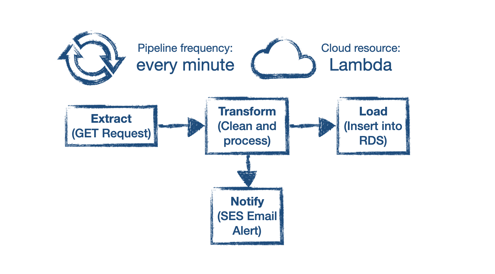
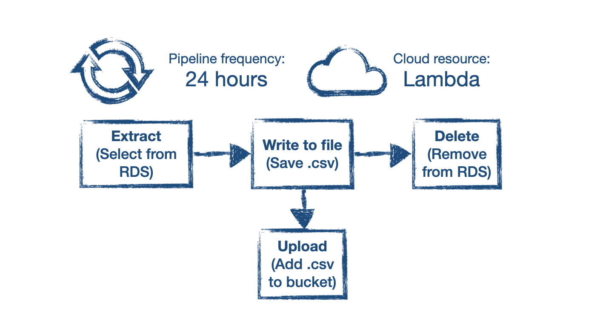
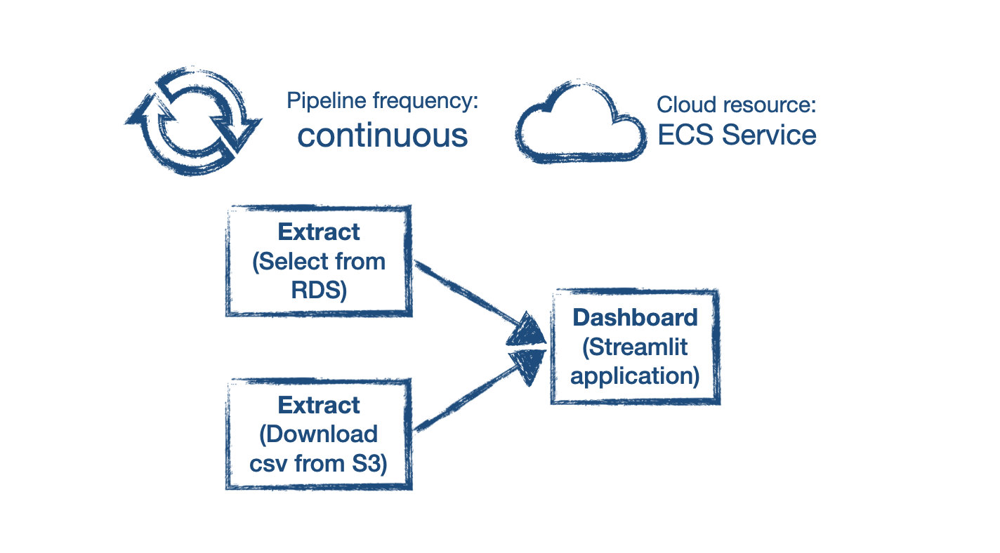

# ontheb-rink-ofextinction

## Project Introduction

This repository contains the code for a data processing project for the Liverpool Natural History Museum. Plants in the newly opened botanical wing are all fitted with sensors which report data every minute. This project aims to provide a solution to managing the volume of data being generated by these sensors and enable data insights to be made by the LNHM botanists.

## Project Architecture

The project is split into three sections:

- **Live data processing pipeline.** This runs every minute as a Lambda function from an ECR repository hosted on AWS. GET requests are used to obtain the sensor data which is then cleaned and transformed before being inserted into an PostgreSQL RDS hosted on AWS. The live pipeline runs every minute and therefore does not need a continuous option, hence Lambda was chosen. In addition, it is a lightweight service and is charged based on use so is an economical choice.

- **Archiving old data pipeline.** This runs every twenty four hours as a Lambda function from an ECR repository hosted on AWS. Entries older than twenty four hours are saved to a `.csv` file which is uploaded to an S3 bucket. These rows are then deleted from the RDS. We have chosen a Lambda function as invocation of archiving is infrequent and Lambda allows for cheaper costs as it only charges what is used.

- **Interactive dashboard.** This is a continuously running AWS ECS Service. The dashboard is written with Python and uses the Streamlit library. The Dashboard is configured to read in both recent data from the RDS as well as archived data from S3. ECS Service was chosen as we are not concerned about hardware decisions and wanted a continuous running application to display our dashboard data.

## Repository Configuration

All code was written for use with Python 3.11. All unit tests have been written for `pytest`. Code has been tested to be above a pylint score of 8. Both pylint and pytest use continuous integration workflows when pushed to main.

The necessary environment variables for each script are outlined in the respective `README.md` files. It is not possible to run the scripts without the necessary AWS credentials.

- `live_pipeline` contains the code for the **Live data processing pipeline**. The ETL stages are separated into individual directories with supporting `README.md` files.

- `archive_pipeline` contains the code for the **Archiving old data pipeline**. There is a single `README.md` that explains how to run the code in this directory.

- `dashboard` contains the code for the **Interactive dashboard**. There is a single `README.md` that explains how to launch the dashboard.

## Further Project Scope

If we had more time we would consider incorporating a function to send alerts directly to the botanist concerned in looking after the wellbeing of that plant. In addition, when we create our dashboard we would want to add functionality so that users can input any visual bugs and this can be sent to the developers. To help with the developing side of the project, it would be useful to receive an alert or notification when the RDS is nearing full and how full it is.

In terms of smaller modifications to we could present the names of the archived data on the dashboard a bit better e.g. Thu 31 Aug 2023 instead of archived_2023_08_31.csv

To include more of the raw data we could incorporate the data on plant origin, plants on loan and plants that are missing. These can be used to report any missing plant data from the dashboard. Plant origin data can be useful to group plants from teh same origins and to compare the data in that way too. We could create average temperatures and soil moisture readings for each plants and then compare the new data to this average to highlight abnormal results for that specific plant.
